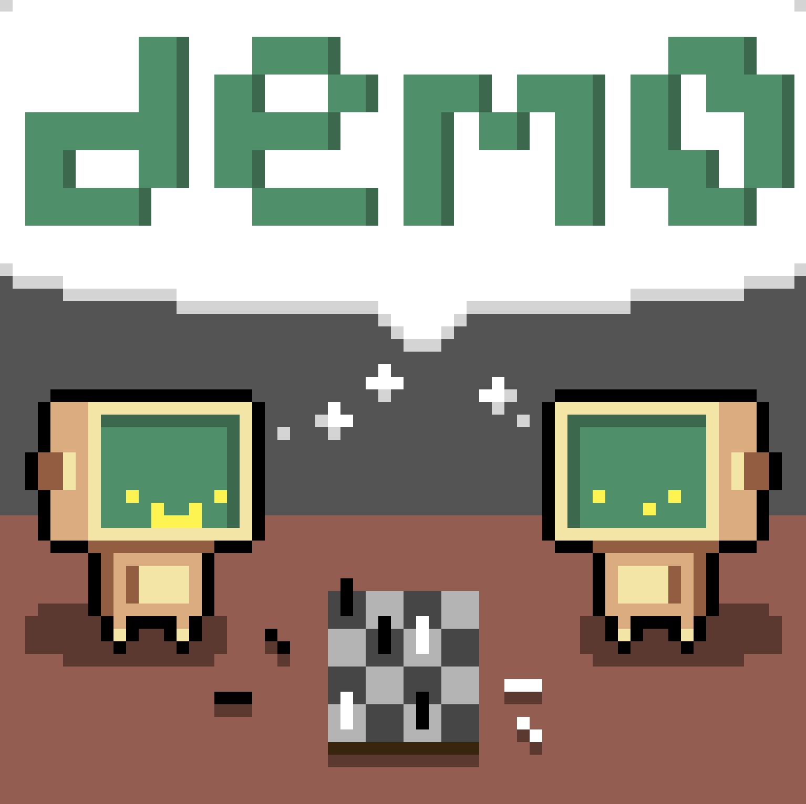

*dem0* is an [AlphaGo Zero](https://www.nature.com/articles/nature24270)-inspired chess engine.

## Network Architecture

As per the paper:

---

### **Convolutional Block**
> *The convolutional block applies the following modules:*  
> **(1)** A convolution of 256 filters of kernel size 3 × 3 with stride 1  
> **(2)** Batch normalization  
> **(3)** A rectifier nonlinearity  

---

### **Residual Block**
> *Each residual block applies the following modules sequentially to its input:*  
> **(1)** A convolution of 256 filters of kernel size 3 × 3 with stride 1  
> **(2)** Batch normalization  
> **(3)** A rectifier nonlinearity  
> **(4)** A convolution of 256 filters of kernel size 3 × 3 with stride 1  
> **(5)** Batch normalization  
> **(6)** A skip connection that adds the input to the block  
> **(7)** A rectifier nonlinearity
---

### **Policy Head**
> *The output of the residual tower is passed into two separate ‘heads’ for computing the policy and value. The policy head applies the following modules:*  
> **(1)** A convolution of 2 filters of kernel size 1 × 1 with stride 1  
> **(2)** Batch normalization  
> **(3)** A rectifier nonlinearity  
> **(4)** A fully connected linear layer that outputs a vector of size $19^2 + 1 = 362$, corresponding to logit probabilities for all intersections and the pass move **(NOTE: DIFFERENT SIZE FOR CHESS!)**

---

### **Value Head**
> *The value head applies the following modules:*  
> **(1)** A convolution of 1 filter of kernel size 1 × 1 with stride 1  
> **(2)** Batch normalization  
> **(3)** A rectifier nonlinearity  
> **(4)** A fully connected linear layer to a hidden layer of size 256  
> **(5)** A rectifier nonlinearity  
> **(6)** A fully connected linear layer to a scalar  
> **(7)** A tanh nonlinearity outputting a scalar in the range [−1, 1] 
---

